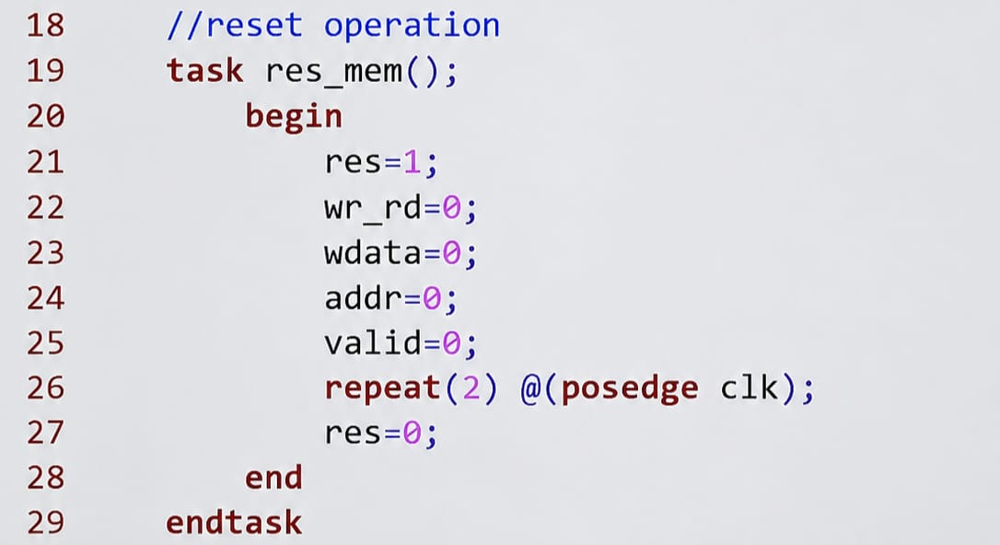
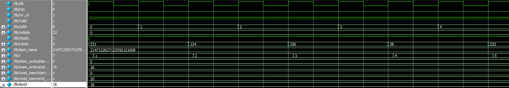

# Single-Port-RAM-Verilog
Parameterized Single-Port RAM Design and Verification using Verilog HDL
# Single-Port RAM using Verilog HDL

## Overview
Implemented and verified a parameterized Single-Port RAM using Verilog HDL.

### Features
- Synchronous Read
- Synchronous Write
- Memory Reset
- Valid-Ready Handshake
- Parameterized Design

### Verification
- Reset Task
- Write Task
- Read Task
- Random Data Testing

### Results
Simulation waveforms confirm successful memory write and read operations.

## Author
Yaswanth Reddy

## RTL Design

.jpeg)

## Reset Task

## Write Task

.jpeg)

## Read Task

## Simulation Waveforms

